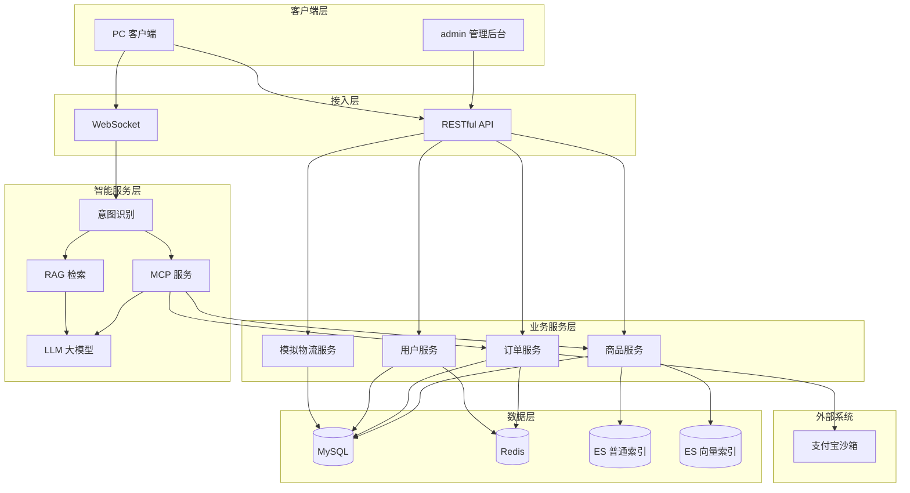
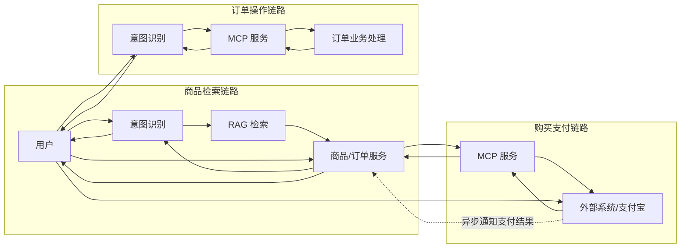

# SmartMall Java

SmartMall Java 是一个围绕“智能购物商城”场景设计的多模块后端工程。项目以传统电商交易链路为基础，融合 AI 意图识别、RAG 检索、MCP 工具服务与 WebSocket 对话交互能力，目标是同时支持“普通购物模式”和“智能购物模式”两条业务路径。

本仓库当前以后端实现为主，配套提供系统架构图、业务流程图、功能导图、技术方案说明、SQL 脚本与 Apifox 联调文档。

## 项目定位

本项目的整体目标不是单一商城接口系统，而是一个融合传统交易与智能对话能力的“智能购物商城”平台：

- 普通购物模式：商品浏览、购物车、订单、支付、退款、物流、评价
- 智能购物模式：自然语言检索商品、对话式下单、对话式订单操作
- 管理后台：商品、分类、订单、用户、系统配置、知识库配置
- AI 能力支撑：LLM、大模型意图识别、RAG 检索、MCP 工具调用

## 系统架构图

整体分为五个关键部分：



### 1. 客户端层

包含两类访问入口：

- `admin` 管理后台
- `PC` 客户端

客户端通过 `HTTP` 调用传统业务接口，通过 `WebSocket` 接入智能购物场景。

### 2. 业务服务层

业务服务层是当前仓库的核心实现区，主要包括：

- 商品服务
- 订单服务
- 用户服务
- 模拟物流服务

其中订单服务与商品服务连接最紧密，承担购物车、下单、支付、退款、发货、收货、评价等主链路能力。

### 3. 智能服务层

智能服务层位于传统业务层与大模型之间，负责把自然语言请求转换为可执行业务动作，主要包含：

- 意图识别
- MCP 服务
- RAG 检索
- LLM 大模型能力接入

该层的作用是让用户除了通过页面点击操作外，还可以通过对话完成商品搜索、订单查询、退款、取消订单等动作。

### 4. 数据层

数据层同时支持结构化业务数据和检索型数据：

- `MySQL`：业务主数据
- `Redis`：缓存与会话
- `ES 普通索引`：商品全文检索
- `ES 向量索引`：语义检索 / RAG 支撑

### 5. 外部系统

当前架构中已经明确接入：

- 支付宝沙箱

用于完成支付链接生成、支付结果回调与订单支付状态流转。

## 业务流程图



业务流程图展示了三条核心业务路径。


### 商品检索意图图

用户在智能购物模式下发出请求后，系统处理流程为：

1. 用户发送请求
2. 意图识别模块提取查询关键词
3. RAG 检索模块检索候选商品
4. 商品 / 订单服务返回结构化商品信息
5. 结果回传给用户

这条链路体现了“自然语言商品搜索”不是直接调用数据库，而是通过“意图识别 + RAG 检索 + 业务服务”的组合完成。

### 购买商品流程

业务流程图中，购买链路大致为：

1. 用户发起购买
2. 商品 / 订单服务生成支付上下文
3. MCP 服务调用外部支付系统获取支付信息
4. 返回支付链接给用户
5. 用户付款
6. 外部系统异步通知支付结果
7. 订单状态更新

这与当前仓库中已落地的“订单创建 → 支付提交 → 支付回调”实现是一致的。

### 订单操作意图图

订单类自然语言操作包括：

- 退款
- 取消订单
- 查询物流
- 确认订单 / 确认收货
- 评价商品

这些操作在智能模式下由意图识别模块理解请求后，交由 MCP 服务与业务服务执行，再以流式结果返回用户。

## 功能导图

功能导图从“管理员后台”和“访客 / 用户侧”两大视角描述了系统范围。

### 后台管理侧

功能导图中后台主要包括：

- 首页数据概览
  - 当前实时销售、销售额、订单数、用户数、退款信息
  - 近七日销售数据趋势
  - 代发货订单
  - 库存不足预警商品
- 商品管理
  - 分类管理
  - 商品属性管理
  - 发布商品
  - 商品推荐
  - 商品上下架
  - 删除商品
- 订单管理
  - 发货
  - 回复买家
- 订单评价
  - 展示所有评价
  - 删除评价
  - 回复买家
- 用户管理
  - 禁用 / 启用用户
- 系统设置
  - 发货信息管理
  - 提示词管理
  - RAG 知识库

### 用户侧：普通购物模式

普通购物模式下，功能导图包含：

- 账号
  - 登录
  - 注册
  - 退出
  - 更新密码
- 商品展示
  - 分类展示
  - 推荐商品
  - 热门商品
- 商品详情
  - 用户评价
  - 商品详情
  - 产品图展示
  - SKU 组合展示
- 购物车
  - 加入购物车
  - 台车支付 / 结算
- 我的订单
  - 待付款
  - 待发货
  - 待收货
  - 待评价
  - 取消支付
  - 继续支付
  - 退款
  - 确认收货
  - 查看物流
  - 删除订单
  - 评价、追评
- 评价管理
  - 追评
  - 删除评论
- 收货地址
  - 新增、修改、删除、默认设置
- 搜索
  - 按分类、商品名、销量、价格排序、价格区间搜索

### 用户侧：智能购物模式

功能导图中明确给出了智能模式的能力边界：

- 智能购物：描述需求，智能推荐商品
- 查询订单：基于订单状态查看订单需求，智能查询并展示订单
- 退款：语言智能描述退款需求，系统实现退款
- 查看物流：语言描述查看物流需求，智能查询订单物流并展示
- 取消订单：未支付订单可通过语言取消
- 确认收货：已到货订单可通过语言确认
- 评价：评价内容与评分可通过智能体完成
- 咨询站长：回答与平台有关的相关问题

## 技术方案

系统技术方案分为以下几层：

### 后端技术栈

- Java 21
- Spring Boot 3.x
- Spring AI
- Netty

### AI 与搜索组件

- Elasticsearch：全文检索 + 向量检索
- RAG Pipeline
- MCP 工具集成

### 数据存储

- MySQL 8+
- Redis

### 前端技术栈

- Vue 3
- Pinia
- Element Plus
- Vite

### 支付集成

- 支付宝沙箱环境

## 代码模块与架构映射

本仓库当前模块与架构图的对应关系如下：

### `smartMall-common`

对应业务逻辑层与数据访问层的核心实现，包含：

- 实体、DTO、VO、枚举
- Mapper、Service、ServiceImpl
- 统一异常处理
- 商品、购物车、订单、支付、退款、物流、评价等领域逻辑

### `smartMall-admin`

对应架构图中的管理后台服务入口，负责后台 HTTP 接口。

当前已实现的后台能力主要包括：

- 登录 / 验证码 / 退出
- 分类管理
- 分类属性管理
- 商品管理
- 文件上传与资源访问

### `smartMall-web`

对应普通购物模式的业务服务入口，负责用户端 HTTP 接口。

当前已实现的用户链路包括：

- 商品列表 / 推荐 / 详情
- 购物车
- 订单预结算 / 创建 / 查询 / 取消
- 支付提交 / 回调
- 退款申请 / 详情 / 审批
- 模拟发货 / 查询物流 / 确认收货
- 订单评价 / 商品评价查询

### `smartMall-mcp`

对应智能服务层中的 MCP 服务接入模块，用于支撑未来的智能体工具调用与 AI 业务编排。

## 当前仓库已落地能力

结合 `doc/development-log.md` 与现有代码，当前仓库已完成以下主要能力：

- 商品浏览与商品详情接口
- 用户端购物车基础能力
- 用户端订单创建与结算能力
- 用户端支付下单与支付回调能力
- 用户端退款申请与退款状态流转
- 用户端发货模拟与确认收货
- 用户端商品评价与订单完成
- 后台分类、商品、文件上传、账号登录等基础能力

也就是说，架构图中的“传统商城主交易链路”在当前仓库中已经具备较完整的后端基础。

## 项目目录

```text
smartMall-java
├─ doc/                              开发日志与 SQL 脚本
├─ pictures/                         文件资源目录
├─ smartMall-common/                 公共业务模块
├─ smartMall-admin/                  后台服务模块
├─ smartMall-web/                    用户端服务模块
├─ smartMall-mcp/                    MCP 服务模块
├─ system-architecture/              系统架构目录
│  ├─ architecture.png               系统架构图
│  ├─ business-pipline.png           业务流程图
│  ├─ Functional map.png             功能导图
│  └─ 技术方案与架构.md              技术方案说明
├─ apifox_requests.md                接口调试与测试用例
├─ pom.xml                           Maven 聚合工程
└─ README.md                         项目说明文档
```

## 运行环境

- JDK 21
- Maven 3.9+
- MySQL 8+
- Redis

## 服务配置

当前仓库中主要服务配置如下：

| 模块 | 端口 | 上下文 / 说明 |
| --- | --- | --- |
| `smartMall-admin` | `6061` | `/api` |
| `smartMall-web` | `6050` | `/api` |
| `smartMall-web` WebSocket | `6051` | 智能购物通信端口 |
| `smartMall-mcp` | `8084` | MCP 端点 `/mcp` |

## 数据初始化

执行以下 SQL 文件完成数据库初始化：

- `doc/sql/smart-mall.sql`

## 接口与文档资料

- 开发日志：`doc/development-log.md`
- 接口调试文档：`apifox_requests.md`
- SQL 脚本：`doc/sql/smart-mall.sql`
